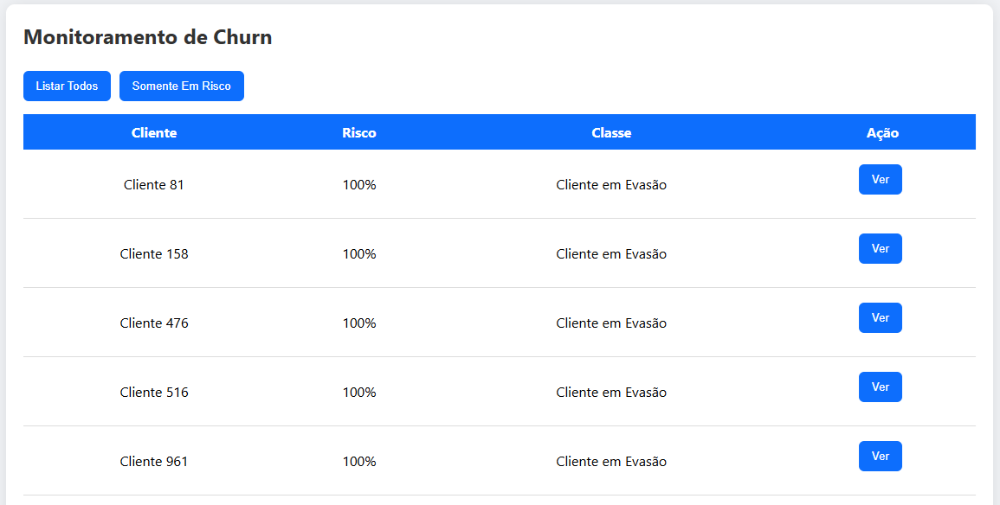
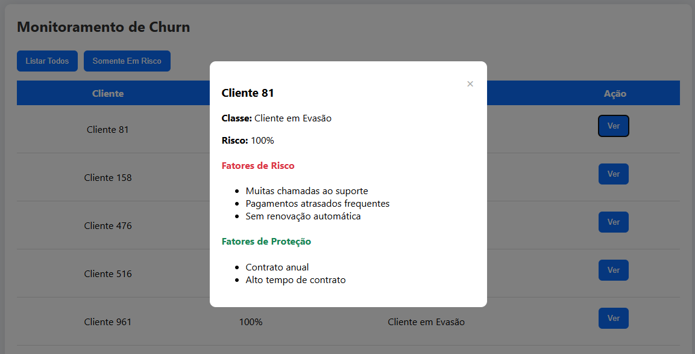
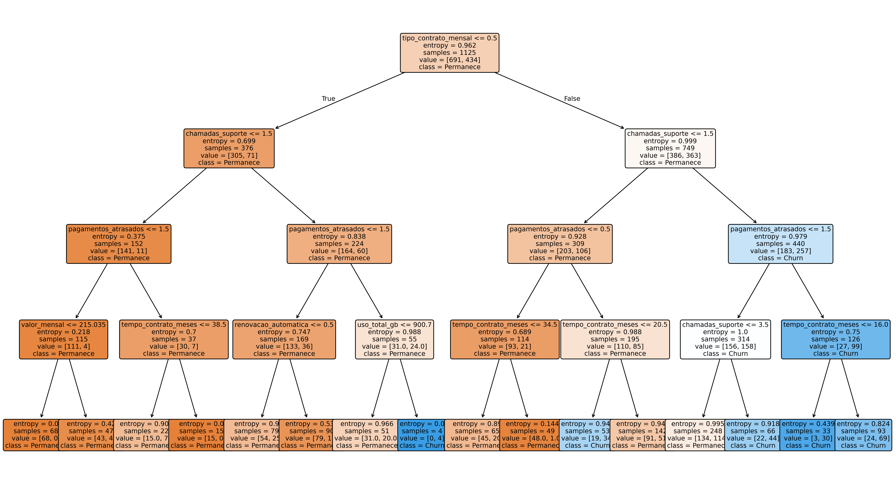

# 📊 Previsão de Churn com Árvore de Decisão (Churn Prediction with Decision Tree)

Este projeto apresenta um sistema completo de previsão de churn, indo além de um simples modelo de Machine Learning.
Ele entrega um pipeline automatizado + API de inferência + dashboard web interativo, permitindo analisar clientes, visualizar riscos e justificar decisões do modelo.

Trata-se de um projeto end-to-end, com foco em arquitetura profissional de ML, ideal para portfólio de Ciência de Dados, Machine Learning e Engenharia de Software.

---

## 🎯 Objetivo do Projeto

Responder perguntas como:

> “Quais clientes apresentam maior risco de churn e por quê?”

Além de prever, o sistema explica os fatores de risco e proteção de cada cliente, entregando uma visão clara para analistas, gestores e times de negócio.

---

## ⚙️ Fluxo de Execução do Projeto

A execução segue um pipeline organizado em três etapas:

### 1️⃣ Pipeline de Machine Learning

Executar o arquivo principal:

```bash
\python main.py
```

Esse comando:

- Gera automaticamente o dataset sintético
- Treina a Árvore de Decisão
- Avalia o modelo
- Gera a imagem da árvore
- Exporta o modelo treinado

---

### 2️⃣ Inicializar a API de Inferência

```bash
\uvicorn api.app:app 
```

A API ficará disponível em:

- API base → http://127.0.0.1:8000

- Swagger UI → http://127.0.0.1:8000/docs


---

### 3️⃣ Abrir o Dashboard Web

Interface web disponível em:

👉 http://127.0.0.1:8000/app

A partir dela é possível:
- Listar clientes
- Ordenar por risco
- Visualizar motivos de churn
- Analisar fatores positivos e negativos de cada perfil

---

## 🖥 Interface Web (Dashboard)





---

## 🧠 Visualização da Árvore de Decisão

A imagem abaixo representa a Árvore de Decisão aprendida pelo modelo, mostrando de forma visual como o algoritmo toma decisões para classificar clientes como ativos ou em risco de churn.

Cada nó da árvore indica:
- A variável utilizada na decisão  
- O valor de corte aplicado  
- A proporção de clientes em cada classe  
- O caminho seguido até a decisão final  

Essa visualização permite compreender:
- Quais fatores mais impactam o churn  
- Como o modelo interpreta o comportamento dos clientes  
- Onde estão os principais pontos de risco e proteção  



---

## 🧠 Conceitos Aplicados

- Machine Learning Supervisionado
- Árvores de Decisão
- Entropia e Ganho de Informação
- Feature Engineering
- Geração de dados sintéticos
- Avaliação de modelos
- Deploy local com FastAPI
- API REST de inferência
- Interface Web de monitoramento

---

## 📦 Tecnologias Utilizadas

- Python 3.12
- Pandas
- NumPy
- Scikit-learn
- Matplotlib
- FastAPI
- HTML, CSS, JavaScript

---

## 🗂 Estrutura do Projeto

```text
predicao-churn-arvore-de-decisao/
│
├── api/
│ ├── app.py               # API FastAPI com inferência e dashboard
│ ├── model.joblib         # Modelo treinado exportado
│ └── static/              # Interface web (dashboard)
│   ├── index.html
│   ├── style.css
│   └── script.js
│
├── assets/                # Imagens para documentação do GitHub
│ ├── decision_tree.png
│ ├── screenshot-ui.png
│ └── screenshot-ui-modal.png
│
├── data/                  # Dataset sintético (gerado automaticamente)
│ └── churn_synthetic.csv
│
├── images/                # Visualização da árvore de decisão
│ └── decision_tree.png
│
├── src/                   # Pipeline de Machine Learning
│ ├── generate_data.py     # Geração de dados sintéticos
│ ├── train_model.py       # Treinamento do modelo
│ ├── interpret_model.py   # Interpretação das decisões
│ └── visualize_tree.py    # Exportação da árvore aprendida
│
├── main.py                # Orquestrador do pipeline completo
├── requirements.txt
└── README.md
```

---

## 🚀 Diferenciais

✔ Projeto completo (modelo + API + interface)

✔ Visualização de decisões do modelo

✔ Justificativa dos fatores de risco e proteção

✔ Arquitetura próxima de produto real

✔ Excelente para portfólio de Data Science e ML

---

Projeto desenvolvido com foco em boas práticas, clareza conceitual e aplicabilidade real de Machine Learning em negócios.
